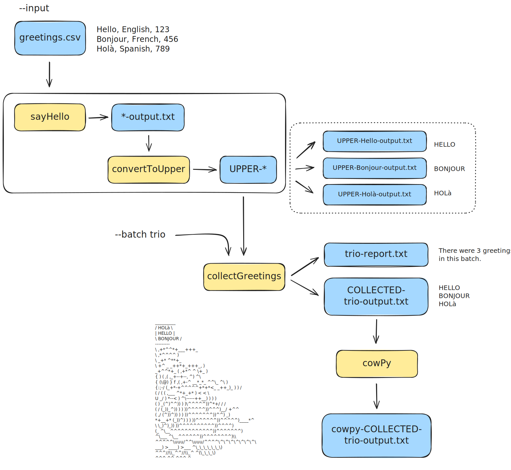

# Generalizing the _Hello_ pipeline

## Learning outcomes

**After having completed this chapter you will be able to:**

- Understand how `nextflow.config` controls parameters, resources and profiles for the `hello-pipeline`.
- Explain how splitting processes into separate module files improves structure and re-use.
- Recognise how dynamic file naming works in process `output` directives and `script` blocks.

## Material

[:fontawesome-solid-file-pdf: Download the presentation](../assets/pdf/site_under_construction.pdf){: .md-button }

## Overview of the `hello-pipeline` project

Let's go to the directory then:

```bash
cd /workspaces/nextflow-training/exercises/hello-pipeline
code .
```

The `hello-pipeline` example (under `exercises/hello-pipeline/`) is a small but realistic DSL2 workflow that illustrates:

- **Configuration in `nextflow.config`** (parameters, process resources, profiles, outputs).
- **Modular code structure** using a `modules/` folder.
- **Dynamic file naming** based on values flowing through the pipeline.

??? abstract "These are the files in the directory"
    ```console title="hello-pipeline/"
      hello-pipeline
      ├── hello-pipeline.nf
      ├── modules
      │   ├── collectGreetings.nf
      │   ├── convertToUpper.nf
      │   ├── cowpy.nf
      │   └── sayHello.nf
      └── nextflow.config
    ```

The main entry point is:

- `hello-pipeline.nf` (workflow definition)
- `nextflow.config` (configuration)
- `modules/*.nf` (process modules)

### The workflow at a glance

In `hello-pipeline.nf`, the workflow:

<figure markdown align="center">
  
</figure>

- Reads greetings from a CSV file (`params.input`).
- Emits a greeting per line (`sayHello`).
- Converts greetings to upper case (`convertToUpper`).
- Collects all greetings into one file and a small report (`collectGreetings`).
- Generates ASCII “art” for the final greetings using `cowpy` (`cowpy` module).

The **dataflow** and **basic DSL2 concepts** are covered in the [Introduction to Nextflow](./2_introduction_nextflow.md); here we zoom in on:

- How configuration, modules and filenames are wired together.
- How changing `nextflow.config` changes the behaviour of the same code.
- How Channels are created.

## `nextflow.config`: centralizing settings

The `nextflow.config` file controls:

??? full-code "nextflow.config"
    ```groovy title="nextflow.config" linenums="1"
    docker.enabled = true

    /*
    * Process settings
    */
    process {
        memory = 1.GB
        withName: 'cowpy' {
            memory = 2.GB
            cpus = 2
        }
    }

    /*
    * Pipeline parameters
    */
    params {
        input = 'data/greetings.csv'
        batch = 'batch'
        character = 'turkey'
    }

    /*
    * Output settings
    */
    outputDir = "results/${params.batch}"
    workflow.output.mode = 'copy'
    ```


- **Default process resources** (memory, CPUs).
- **Pipeline parameters** (input file, batch name, cow character).
- **Where outputs are published**.

### Process resources and per-process overrides

The `process` block sets default resources for all processes, and then overrides them for specific ones:

??? info "Line to enable docker"
    For now, just ignore line 1 where docker is enabled:
    ```groovy title="nextflow.config" linenums="1"
        docker.enabled = true
    ```
    We'll cover this in the next session.

```groovy title="nextflow.config" linenums="6"
process {
    memory = 1.GB
    withName: 'cowpy' {
        memory = 2.GB
        cpus = 2
    }
}
```

- **Global default**: `memory = 1.GB` for all processes.
- **Process specific**: The process `cowpy` will have dedicated resources with `memory = 2.GB` and `cpus = 2`.

Thus:

- Most processes run with 1 GB RAM and 1 CPU (implicit default).
- `cowpy` is given more memory and CPUs to handle container start-up and text generation.

??? warning "GitHub Codespaces"
    Keep in mind that we are using the free tier of GitHub Codespaces, with only 2 CPUs.

??? tip "Per-process tuning pattern"
    This pattern (`process { ... withName: 'X' { ... } }`) is common in larger pipelines:

    - Start from **sensible global defaults**.
    - Override only the **heavy** or **special** processes.

### Pipeline parameters

The `params` block defines defaults that can be overridden on the command line:

```groovy title="nextflow.config" linenums="17"
params {
    input = 'data/greetings.csv'
    batch = 'batch'
    character = 'turkey'
}
```

- **`params.input`**: path to the input CSV file (e.g. `data/greetings.csv`).
- **`params.batch`**: a short name for the current batch/run (used in filenames and output directory).
- **`params.character`**: which cowpy character to use in the final ASCII art.

**Exercise:** Can you imagine how it is possible to override these parameters?

??? tip "Override parameters"
    [Nextflow parameters](https://training.nextflow.io/2.0/basic_training/config/)

??? success "Answer"
    You can override any of these at run time:

    ```bash
    nextflow run hello-pipeline.nf \
        --input custom_data/my_greetings.csv \
        --batch friday_fun \
        --character tux
    ```

    This will:

    - Read greetings from `custom_data/my_greetings.csv`.
    - Use `friday_fun` in output filenames and directories.
    - Render ASCII art using the `tux` character.

### Output configuration

At the end of `nextflow.config` you will find:

```groovy title="nextflow.config" linenums="27"
outputDir = "results/${params.batch}"
workflow.output.mode = 'copy'
```

- **outputDir**: all published outputs are grouped under a directory named after the batch.
- **workflow.output.mode**: outputs are copied (not symlinked) into the final results directory.

Combined with the `output` block in `hello-pipeline.nf`, this means:

- If `params.batch = 'batch'`, outputs are written under `results/batch/`.
- Changing `--batch` creates a **clean new results folder** for each run.

## Channels

There is a variety of channel factories that we can use to set up a channel cosnidering that they are built in a way that allows us to operate on their contents using operators. You may have noticed the way in which the input file is read: this is a standard practice to read csv files, in which first `channel.fromPath` is called ([Channel factories](https://docs.seqera.io/nextflow/reference/channel)), and then the operators splitCsv() and map{} are invoked. This is done to generate a file name dynamically so that the final file names will be unique. We will cover more about operators in the next session.

**From `hello-pipeline.nf`, keep in mind that each process like `sayHello`, `convertToUpper`, etc., is creating a channel through which the output(s) are flowing.**

??? info "Make file names unique"
    A common way to make the file names unique is to use some unique piece of metadata from the inputs (received from the input channel) as part of the output file name. Here, for convenience, we'll just use the greeting itself since it's just a short string, and prepend it to the base output filename.

??? full-code "hello-pipeline.nf"
    ```groovy title="hello-pipeline.nf" linenums="1" hl_lines="22-24"
    #!/usr/bin/env nextflow

    // Include modules
    include { sayHello          }       from './modules/sayHello.nf'
    include { convertToUpper    }       from './modules/convertToUpper.nf'
    include { collectGreetings  }       from './modules/collectGreetings.nf'
    include { cowpy             }       from './modules/cowpy.nf'

    /*
    * Pipeline parameters
    */
    params {
        input: Path
        batch: String
        character: String
    }

    workflow {

        main:
        // create a channel for inputs from a CSV file
        greeting_ch = channel.fromPath(params.input)
                            .splitCsv()
                            .map { line -> line[0] }
        // emit a greeting
        sayHello(greeting_ch)
        // convert the greeting to uppercase
        convertToUpper(sayHello.out)
        // collect all the greetings into one file
        collectGreetings(convertToUpper.out.collect(), params.batch)
        // generate ASCII art of the greetings with cowpy
        cowpy(collectGreetings.out.outfile, params.character)

        publish:
        first_output = sayHello.out
        uppercased = convertToUpper.out
        collected = collectGreetings.out.outfile
        batch_report = collectGreetings.out.report
        cowpy_art = cowpy.out
    }

    output {
        first_output {
            path { sayHello.name }
        }
        uppercased {
            path { convertToUpper.name }
        }
        collected {
            path { collectGreetings.name }
        }
        batch_report {
            path { collectGreetings.name }
        }
        cowpy_art {
            path { cowpy.name }
        }
    }
    ```

## Modules: processes in separate files

In `hello-pipeline.nf`, each process is defined in its own module file under `modules/`, and then imported at the top of `hello-pipeline.nf`:

```groovy title="hello-pipeline.nf" linenums="4"
    // Include modules
    include { sayHello          }       from './modules/sayHello.nf'
    include { convertToUpper    }       from './modules/convertToUpper.nf'
    include { collectGreetings  }       from './modules/collectGreetings.nf'
    include { cowpy             }       from './modules/cowpy.nf'
```

This structure:

- Keeps each process **short and focused**.
- Makes it easier to **reuse** a process in other pipelines.
- Separates **workflow logic** (`hello-pipeline.nf`) from **implementation details** (`modules/*.nf`).

??? info "Same pattern at larger scale"
    In real projects, you often have:

    - A `workflow/` or `modules/` folder with many small process modules.
    - One or a few entry-point workflows that glue them together using `include` statements.

## Dynamic naming of files in modules

The `hello-pipeline` shows several patterns for **dynamic filenames**, where outputs depend on values such as:

- The greeting text itself.
- The batch name.
- The input file name.

### Filenames based on the greeting

In `modules/sayHello.nf`:

- The process receives a **value** `greeting`.

```groovy title="modules/sayHello.nf" linenums="6"
    input:
    val greeting
```

- The `output` directive declares a file path using string interpolation:

```groovy title="modules/sayHello.nf" linenums="9"
    output:
    path "${greeting}-output.txt"
```

- The `script` block uses the same pattern when writing the file.

This ensures:

- Each input greeting produces its **own output file**.
- Filenames are **traceable** (the greeting is visible in the filename).

### Filenames derived from inputs

In `modules/convertToUpper.nf`:

- The process receives a **path** `input_file`.

```groovy title="modules/convertToUpper.nf" linenums="6"
    input:
    path input_file
```

- The `output` directive uses:

```groovy title="modules/convertToUpper.nf" linenums="10"
    output:
    path "UPPER-${input_file}"
```

Nextflow replaces `${input_file}` with the actual filename, so if the input is `hello-output.txt` the output is:

- `UPPER-hello-output.txt`

This pattern:

- Preserves the original filename.
- Adds a clear prefix to show **which step** produced the file.

### Using parameters in filenames

In `modules/collectGreetings.nf`:

- Inputs:

```groovy title="modules/collectGreetings.nf" linenums="6"
    input:
    path input_files
    val batch_name
```

- Outputs:

```groovy title="modules/collectGreetings.nf" linenums="10"
    output:
    path "COLLECTED-${batch_name}-output.txt", emit: outfile
    path "${batch_name}-report.txt", emit: report
```

Here:

- The **batch name** is inserted into the output filenames.
- The `emit` labels (`outfile`, `report`) let the workflow refer to each output **by name** instead of by position.

**Exercise:** Stop for a moment and think: where is the `batch` name coming from?

??? success "Answer"
    Remember that everything is controlled now from `nextflow.config`, and in such file the parameter `params.batch` was stated.

    - Changing `--batch` changes both **output directory** and **filenames**, keeping different runs tidy.

### Prefixing filenames with the tool name

In `modules/cowpy.nf`:

??? info "Line to enable docker"
    For now, just ignore line 4 where the container is specified:
    ```groovy title="modules/cowpy.nf" linenums="4"
        container 'community.wave.seqera.io/library/cowpy:1.1.5--3db457ae1977a273'
    ```
    We'll cover this in the next session.

- Input:

```groovy title="modules/cowpy.nf" linenums="6"
    input:
    path input_file
    val character
```

- Output:

```groovy title="modules/cowpy.nf" linenums="10"
    output:
    path "cowpy-${input_file}"
```

Again, `${input_file}` is expanded to the actual filename of the collected greetings file, and the `cowpy-` prefix indicates which process created this output.

### Dynamic naming in the workflow `output` block

The `hello-pipeline.nf` file uses a final `output` block to publish results. Instead of hard-coding paths, it uses:

```groovy title="modules/cowpy.nf" linenums="42"
output {
    first_output {
        path { sayHello.name }
    }
    uppercased {
        path { convertToUpper.name }
    }
    collected {
        path { collectGreetings.name }
    }
    batch_report {
        path { collectGreetings.name }
    }
    cowpy_art {
        path { cowpy.name }
    }
}
```

The `.name` property refers to the underlying process or module name:

- This keeps the **final publication logic** short and consistent.
- If you rename a process, you only update it in one place.

**Exercise:** Try to apply what you have learned so far to reuse the process `copy_file` developed during [Introduction to Nextflow](./2_introduction_nextflow.md). The goal is to copy the file generated by the last process (`cowpy`) in this pipeline.

??? tip "Organize your ideas"
    1. Create the module where the others modules are located.
    2. Call that module in the `hello-pipeline.nf`.
    3. Identify which output the module will take from `cowpy`.
    4. Adjust the module if necessary to process the output from `cowpy`.
    5. Define what is going to be generated within the `copy_file` and where it is going to be published.
    6. State in `hello-pipeline.nf` where the output directory.

??? success "Answer"
    Find below how the files would be modified.

??? full-code "modules/copy_file.nf"
    ```groovy title="modules/copy_file.nf" linenums="1"
    process copy_file {
    input:
        path cowpy_file
    output:
        path 'copied_cowpy.txt'
    script:
        """
        cp ${cowpy_file} copied_cowpy.txt
        """
    }
    ```

??? full-code "hello-pipeline.nf"
    ```groovy title="hello-pipeline.nf" linenums="1" hl_lines="8 35 43 62-64"
    #!/usr/bin/env nextflow

    // Include modules
    include { sayHello          }       from './modules/sayHello.nf'
    include { convertToUpper    }       from './modules/convertToUpper.nf'
    include { collectGreetings  }       from './modules/collectGreetings.nf'
    include { cowpy             }       from './modules/cowpy.nf'
    include { copy_file         }       from './modules/copy_file.nf'

    /*
    * Pipeline parameters
    */
    params {
        input: Path
        batch: String
        character: String
    }

    workflow {

        main:
        // create a channel for inputs from a CSV file
        greeting_ch = channel.fromPath(params.input)
                            .splitCsv()
                            .map { line -> line[0] }
        // emit a greeting
        sayHello(greeting_ch)
        // convert the greeting to uppercase
        convertToUpper(sayHello.out)
        // collect all the greetings into one file
        collectGreetings(convertToUpper.out.collect(), params.batch)
        // generate ASCII art of the greetings with cowpy
        cowpy(collectGreetings.out.outfile, params.character)
        // copy the file generated by cowpy
        copy_file(cowpy.out)

        publish:
        first_output = sayHello.out
        uppercased = convertToUpper.out
        collected = collectGreetings.out.outfile
        batch_report = collectGreetings.out.report
        cowpy_art = cowpy.out
        copied_file = copy_file.out
    }

    output {
        first_output {
            path { sayHello.name }
        }
        uppercased {
            path { convertToUpper.name }
        }
        collected {
            path { collectGreetings.name }
        }
        batch_report {
            path { collectGreetings.name }
        }
        cowpy_art {
            path { cowpy.name }
        }
        copied_file {
            path { copy_file.name }
        }
    }
    ```

## Summary

- `nextflow.config` centralizes **parameters**, **resources** and **output settings**, allowing you to switch environments without changing code.
- Splitting processes into a `modules/` folder keeps the workflow **modular**, **readable** and **reusable**.
- Dynamic filenames (using string interpolation) make outputs **self-describing** and integrate naturally with `params` such as `batch`.