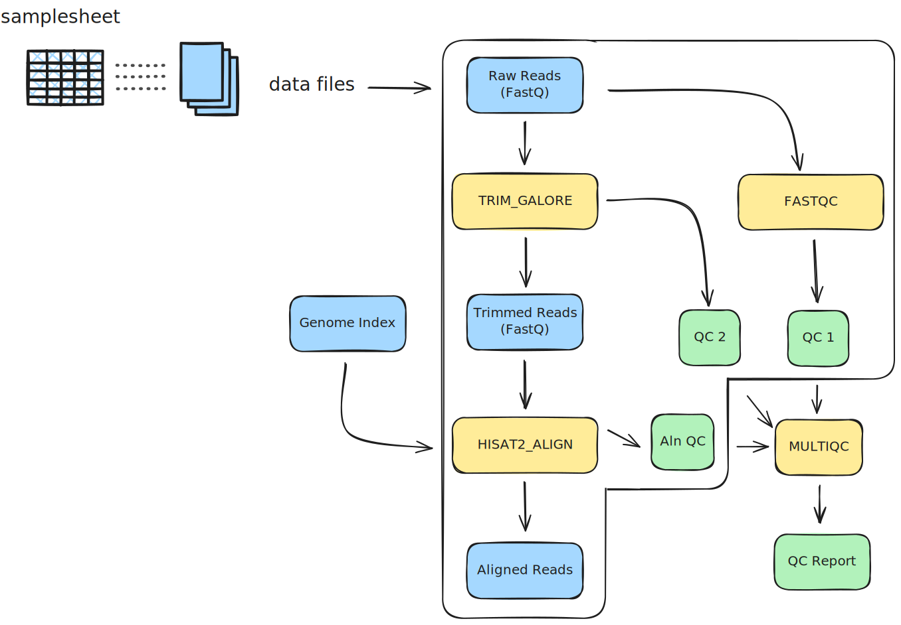

# RNA-seq pipeline: executors, operators, software management and profiles

## Learning outcomes

**After having completed this stage you will be able to:**

- Explain how **executors** control where the RNA-seq workflow runs (local vs. cluster).
- Use common channel **operators** (e.g. `splitCsv`, `map`, `mix`, `collect`) to orchestrate complex logic.
- Configure **software management** using containers and Conda through `nextflow.config` and process directives.
- Define and select **profiles** to adapt the same pipeline to different environments (laptop, HPC, test runs).

## Material

[:fontawesome-solid-file-pdf: Download the presentation](../assets/pdf/site_under_construction.pdf){: .md-button }

## Overview of the RNA-seq pipeline

Let's go to the directory then:

```bash
cd /workspaces/nextflow-training/exercises/rnaseq-pipeline
code .
```

The RNA-seq pipeline in `exercises/rnaseq-pipeline/` is a more realistic example that:

- Uses multiple processes for quality control, trimming, alignment and reporting.
- Leverages **executors** and **profiles** to run on a laptop or on an HPC cluster.
- Chains data with several **channel operators**.
- Runs tools via **containers** or **Conda**, depending on the selected profile.

??? abstract "These are the files in the directory"
    ```console title="rnaseq-pipeline/"
      rnaseq-pipeline
      ├── data
      │   ├── genome_index.tar.gz
      │   ├── paired-end.csv
      │   └── reads
      │       ├── ENCSR000COQ1_1.fastq.gz
      │       ├── ENCSR000COQ1_2.fastq.gz
      │       ├── ENCSR000COQ2_1.fastq.gz
      │       ├── ENCSR000COQ2_2.fastq.gz
      │       ├── ENCSR000COR1_1.fastq.gz
      │       ├── ENCSR000COR1_2.fastq.gz
      │       ├── ENCSR000COR2_1.fastq.gz
      │       ├── ENCSR000COR2_2.fastq.gz
      │       ├── ENCSR000CPO1_1.fastq.gz
      │       ├── ENCSR000CPO1_2.fastq.gz
      │       ├── ENCSR000CPO2_1.fastq.gz
      │       └── ENCSR000CPO2_2.fastq.gz
      ├── modules
      │   ├── fastqc_pe.nf
      │   ├── hisat2_align_pe.nf
      │   ├── multiqc.nf
      │   └── trim_galore_pe.nf
      ├── nextflow.config
      └── rnaseq.nf
    ```

The main components are:

- `rnaseq.nf`: workflow definition (entry point).
- `modules/*.nf`: modular processes (`FASTQC`, `TRIM_GALORE`, `HISAT2_ALIGN`, `MULTIQC`).
- `nextflow.config`: global configuration (executors, profiles, parameters, software engines).

### The workflow at a glance

In `rnaseq-pipeline.nf`, the workflow:

<figure markdown align="center">
  
</figure>

- **FASTQC:** Perform QC on the read data before trimming using FastQC.
- **TRIM_GALORE:** Trim adapter sequences and perform QC after trimming using Trim Galore (bundles Cutadapt and FastQC).
- **HISAT2_ALIGN:** Align reads to the reference genome using Hisat2.
- **MULTIQC:** Generate a comprehensive QC report using MultiQC.

??? full-code "rnaseq.nf"
    ```groovy title="rnaseq.nf" linenums="1"
    #!/usr/bin/env nextflow

    // Module INCLUDE statements
    include { FASTQC              }      from './modules/fastqc_pe.nf'
    include { TRIM_GALORE         }      from './modules/trim_galore_pe.nf'
    include { HISAT2_ALIGN        }      from './modules/hisat2_align_pe.nf'
    include { MULTIQC             }      from './modules/multiqc.nf'

    /*
    * Pipeline parameters
    */
    params {
        // Primary input
        input = ""

        // Reference genome archive
        hisat2_index_zip = ""

        // Report ID
        report_id = ""
    }

    workflow {

        main:
        // Create input channel from the contents of a CSV file
        read_ch = channel.fromPath(params.input)
            .splitCsv(header: true)
            .map { row -> [file(row.fastq_1), file(row.fastq_2)] }

        // Initial quality control
        FASTQC(read_ch)

        // Adapter trimming and post-trimming QC
        TRIM_GALORE(read_ch)

        // Alignment to a reference genome
        HISAT2_ALIGN(TRIM_GALORE.out.trimmed_reads, file(params.hisat2_index_zip))

        // Comprehensive QC report generation
        multiqc_files_ch = channel.empty().mix(
            FASTQC.out.zip,
            FASTQC.out.html,
            TRIM_GALORE.out.trimming_reports,
            TRIM_GALORE.out.fastqc_reports_1,
            TRIM_GALORE.out.fastqc_reports_2,
            HISAT2_ALIGN.out.log,
        )
        multiqc_files_list = multiqc_files_ch.collect()
        MULTIQC(multiqc_files_list, params.report_id)

        publish:
        fastqc_zip = FASTQC.out.zip
        fastqc_html = FASTQC.out.html
        trimmed_reads = TRIM_GALORE.out.trimmed_reads
        trimming_reports = TRIM_GALORE.out.trimming_reports
        trimming_fastqc_1 = TRIM_GALORE.out.fastqc_reports_1
        trimming_fastqc_2 = TRIM_GALORE.out.fastqc_reports_2
        bam = HISAT2_ALIGN.out.bam
        align_log = HISAT2_ALIGN.out.log
        multiqc_report = MULTIQC.out.report
        multiqc_data = MULTIQC.out.data
    }

    output {
        fastqc_zip {
            path 'fastqc'
        }
        fastqc_html {
            path 'fastqc'
        }
        trimmed_reads {
            path 'trimming'
        }
        trimming_reports {
            path 'trimming'
        }
        trimming_fastqc_1 {
            path 'trimming'
        }
        trimming_fastqc_2 {
            path 'trimming'
        }
        bam {
            path 'align'
        }
        align_log {
            path 'align'
        }
        multiqc_report {
            path 'multiqc'
        }
        multiqc_data {
            path 'multiqc'
        }
    }
    ```

??? full-code "nextflow.config"
    ```groovy title="nextflow.config" linenums="1"
    docker.enabled = true
    conda.enabled = false

    profiles {

        my_laptop {
            process.executor = 'local'
            docker.enabled = true
        }
        univ_hpc {
            process.executor = 'slurm'
            conda.enabled = true
            process.resourceLimits = [
                memory: 750.GB,
                cpus: 200,
                time: 30.d
            ]
        }

        test {
            params.input = "data/paired-end.csv"
            params.hisat2_index_zip = "data/genome_index.tar.gz"
            params.report_id = "all_paired-end"
        }
    }
    ```

## Executors: where tasks are run

In this pipeline, the executor is controlled entirely by `nextflow.config` profiles:

- **`my_laptop` profile:**

```groovy title="nextflow.config" linenums="6"
    my_laptop {
        process.executor = 'local'
        docker.enabled = true
    }
```

- **`univ_hpc` profile:**

```groovy title="nextflow.config" linenums="10"
      univ_hpc {
          process.executor = 'slurm'
          conda.enabled = true
          process.resourceLimits = [
              memory: 750.GB,
              cpus: 200,
              time: 30.d
          ]
      }
```

??? warning "Resources in a shared HPC cluster"
    Use the directive `process.resourceLimits` to control the resources allocated per job (memory, CPUs, walltime). Make sure that you are using the specified limits in your cluster, if you don't know them, ask your cluster administrator.

Without specifying a profile, the default executor is used (often `local`, depending on your Nextflow installation). By selecting a profile, you tell Nextflow:

- **Where** to submit each process task (local machine vs. scheduler such as SLURM).
- **How** to manage resources (process-level vs. cluster-level limits).

You can choose an executor profile at run time:

```bash
nextflow run rnaseq.nf -profile my_laptop
nextflow run rnaseq.nf -profile univ_hpc
```

!!! bug "Don't use the `univ_hpc` profile"
    This profile is not actually functional since GitHub Codespaces does not feature SLURM.

??? info "What does the executor actually do?"
    The executor decides:

    - How tasks are queued and started (local processes vs. submitted jobs).
    - How resource requests (CPUs, memory, time) are translated into scheduler options.
    - How logs and exit codes are collected.
    - [More executors](https://www.nextflow.io/docs/latest/executor.html)

??? tip "Profiles can do much more"
    Setting profiles is much more useful than just setting the executors. [Below](./5_rnaseq_executors_profiles.md#profiles-adapting-to-different-environments), you will see other profiles you can create.

## Operators: shaping the dataflow

The workflow in `rnaseq.nf` uses several **channel operators** to prepare inputs and orchestrate multiple outputs:

### Building the read channel

The input section of the workflow:

```groovy title="rnaseq.nf" linenums="27"
    read_ch = channel.fromPath(params.input)
            .splitCsv(header: true)
            .map { row -> [file(row.fastq_1), file(row.fastq_2)] }
```

- Reads `params.input` (a CSV file).
- Uses `splitCsv(header: true)` to read a CSV file and emits one row at a time as a map-like object
- Uses `map` to turn each row into into a pair of FASTQ file paths.
    - The result is a channel of `[read1, read2]` pairs.

The resulting `read_ch` is then passed to:

- `FASTQC(read_ch)` for initial QC.
- `TRIM_GALORE(read_ch)` for trimming and post-trimming QC.

**Exercise:** Go back to the previous [hello pipeline](./3_hello_pipeline.md) and try to understand how the CSV file was handled then.

!!! info "hello-pipeline.nf"
    ```groovy title="hello-pipeline.nf" linenums="13"
        greeting_ch = channel.fromPath(params.input)
                        .splitCsv()
                        .map { line -> line[0] }
    ```

??? success "Reading a CSV file"
    In this case, the only difference is what the _map_ operator is taking from the row or line. Since in that pipeline the only important value from the CSV file is the greeting, _line[0]_ is the only one taken wich corresponds to Hello, Bonjour and Holà.

**Exercise:** Use the operator view() to _print_ on the terminal the actual input and how it goes into the  `read_ch`.

??? success "Exercise: add another operator"
    - Add a `.view()` operator on `read_ch` to print which read pairs are being processed.

    ```groovy title="rnaseq.nf" linenums="27" hl_lines="4"
      read_ch = channel.fromPath(params.input)
          .splitCsv(header: true)
          .map { row -> [file(row.fastq_1), file(row.fastq_2)] }
          .view()
    ```

    - Run the pipeline and confirm that the printed pairs match your expectations.

      ```bash
          nextflow run rnaseq.nf -profile test
      ```

    - Remove `.view()` afterwards to keep the log clean.

### Combining QC outputs for MultiQC

To generate a single MultiQC report, the workflow needs inputs from several processes:

```groovy title="rnaseq.nf" linenums="41"
      multiqc_files_ch = channel.empty().mix(
          FASTQC.out.zip,
          FASTQC.out.html,
          TRIM_GALORE.out.trimming_reports,
          TRIM_GALORE.out.fastqc_reports_1,
          TRIM_GALORE.out.fastqc_reports_2,
          HISAT2_ALIGN.out.log,
      )
      multiqc_files_list = multiqc_files_ch.collect()
```

- `mix(...)`: combines multiple channels into one, keeping all emitted values.
- `collect()`: gathers all emitted items into a list before passing them to the next process.

This pattern:

- Keeps **sample metadata** in a structured form.
- Ensures each process receives the **right set of files** per sample.

Instead of wiring each channel separately, the pipeline:

- Creates an **empty channel** with `channel.empty()`.
- Uses `.mix(...)` to merge all QC-related channels into one `multiqc_files_ch`.
- Uses `.collect()` to turn all QC files into a **single list**.
- Passes that list into `MULTIQC(multiqc_files_list, params.report_id)`.

This shows how operators:

- Let you **compose** complex behaviours (many inputs → one report).
- Keep the workflow block **declarative and readable**.

**Exercise:** Do you actually understand the difference between _mix()_ and _collect()_?
??? success "Not the same"
    The operator _mix()_ takes the output from all the specified channels, but it doesn't mean they are part of the same _list_; they are emitted individually. _collect()_ gathers all of these channel values to consolidate a single _list_.

??? tip "_collect()_ does more than collecting"
    _collect()_ can be used as a flux control operator. This means that even though you don't need to collect all the files in a specific process to execute, you can use it to force the pipeline to wait until all the previous processes are finished. This is useful, for example, when the pipeline includes downloading databases as you might want to wait until all the downloads are finished. Why? Let's suppose that you are downloading three databases, each of them triggering different processes, but they have different sizes. So, when any database is downloaded, the subsequent process starts, but what if this subsequent process fails? The download of the other databases would be interrupted, and you may don't know it. It might appear that the other databases were downloaded successfully. Therefore, you can use _collect()_ to wait until all three downloads are finished to continue with the pipeline.

## Software management: containers and Conda

Software is managed at two levels:

- **Global engine selection** in `nextflow.config`.
- **Process-level declarations** in each module (`container` directive).

### Global settings in `nextflow.config`

At the top of `nextflow.config`:

```groovy title="nextflow.config" linenums="1"
    docker.enabled = true
    conda.enabled = false
```

This means:

- By default, containers are used if a process declares a `container` image.
- Conda is disabled unless turned on by a profile.

In the `univ_hpc` profile:

- `conda.enabled = true`
- You can extend this configuration to provide Conda environment definitions if containers are not available (see below).

### Process-level container images

Each RNA-seq module specifies its container, for instance:

```groovy title="modules/fastqc_pe" linenums="5"
    container "community.wave.seqera.io/library/trim-galore:0.6.10--1bf8ca4e1967cd18"
```

or

```groovy title="modules/hisat2_align_pe" linenums="5"
    container "community.wave.seqera.io/library/hisat2_samtools:5e49f68a37dc010e"
```

With `docker.enabled = true`  in `nextflow.config` (e.g. `my_laptop`):

- Nextflow pulls and runs these images with Docker (or another container engine depending on config).

With `conda.enabled = true` (e.g. `univ_hpc`):

- You can add `conda` directives to the processes. For instance, to execute the process FASTQC(), you can add the proper conda environment:

```groovy title="modules/fastqc_pe" linenums="6"
    conda 'bioconda::fastqc=0.12.1'
```

  You need the channel `bioconda` in this case, and the version `fastqc=0.12.1`.

- Nextflow will then create/use Conda environments instead of containers.

??? info "Many more options"
    Nextflow has evolved to incorporate many other container engines such as Singularity (Apptainer), Charliecloud, Podman, among others, as well as package managers like Mamba (Conda but faster) and Spack. More about [software management](https://docs.seqera.io/nextflow/container).

??? tip "Seqera containers"
    Seqera provides a free service to build containers directly from Conda or PyPI packages when these containers are not available. You only need the name of the packages you want in your container (you can use several) and the resulting technology, Docker or Singularity (also the architecture: amd64 or arm64). Actually, these are the containers we are running with this pipeline, even though they are being pulled by Docker. Please feel free to use it: [Seqera containers](https://seqera.io/containers/)

??? warning "Do not blend technologies"
    Although it is possible, for example, to use Conda in some processes and Docker in others, it is highly encouraged to mantain always the same technology for all processes to avoid conflicts and ease debugging.

## Profiles: adapting to different environments

Let's bring back the profiles found in `nextflow.config` 

```groovy title="nextflow.config" linenums="4"
    profiles {
        my_laptop {
            process.executor = 'local'
            docker.enabled = true
        }
        univ_hpc {
              process.executor = 'slurm'
              conda.enabled = true
              process.resourceLimits = [
                  memory: 750.GB,
                  cpus: 200,
                  time: 30.d
              ]
          }
        test {
                params.input = "data/paired-end.csv"
                params.hisat2_index_zip = "data/genome_index.tar.gz"
                params.report_id = "all_paired-end"
        }
      }
```

Aside from combining executor and software engine settings, profiles can contain parameters to define full executions. Here, the profile `test`

  - Overrides `params.input` to a small CSV (`data/test_local.csv`).
  - Sets `params.hisat2_index_zip` to `data/genome_index.tar.gz`.
  - Sets `params.report_id = "all_paired-end"`.

This lets you:

- Run a **full dataset** or a **small test subset** without modifying `rnaseq.nf`.
- Switch between **local** execution and **cluster** execution with a simple flag.

!!! tip "Combining parameters"
    Profiles can be **comma-separated**:

      - One profile may define parameters (e.g. `test`).
      - Another may define executor and engine (e.g. `my_laptop` or `univ_hpc`).
      - Nextflow merges them from left to right.

    You can run the pipeline like this:

    ```bash
    nextflow run rnaseq.nf -profile test,my_laptop
    ```

**Exercise:** Create a new one, e.g. `codespaces`, and change its executor to disable Docker and include the parameters required to run the pipeline. Execute the pipeline with such profile.

??? success "Exercise: create your own profile"
    Adding the profile in `nextflow.config`:

    ```groovy title="nextflow.config" linenums="24"
        codespaces {
              docker.enabled = false
              params.input = "data/paired-end.csv"
              params.hisat2_index_zip = "data/genome_index.tar.gz"
              params.report_id = "all_paired-end"
        }
    ```

    Executing with: 
    ```bash
    nextflow run rnaseq.nf -profile codespaces
    ```

??? bug "Not working"
    Disabling Docker will cause that Nextflow searches for the tools locally, and they are not installed nor available!

## Putting it all together

In summary, the RNA-seq pipeline demonstrates how to:

- Use **executors** to target different backends (local vs. SLURM) without changing workflow code.
- Combine **operators** (`splitCsv`, `map`, `mix`, `collect`) to route many intermediate files into a single reporting step.
- Manage software with **containers** (and optionally **Conda**) via process directives, controlled globally by `nextflow.config`.
- Define **profiles** to select inputs, executors and software engines at run time, making the same pipeline portable across laptops and HPC clusters.