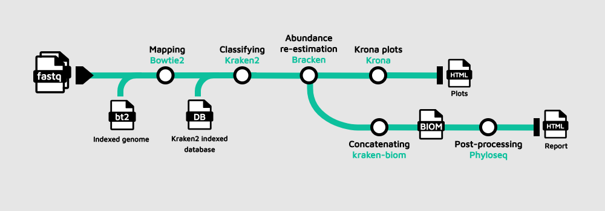
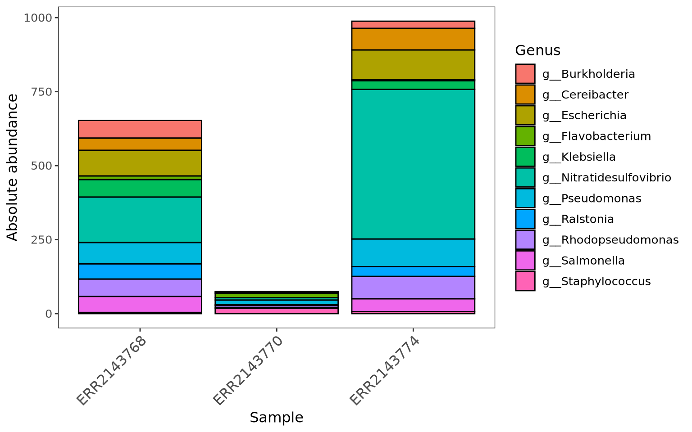
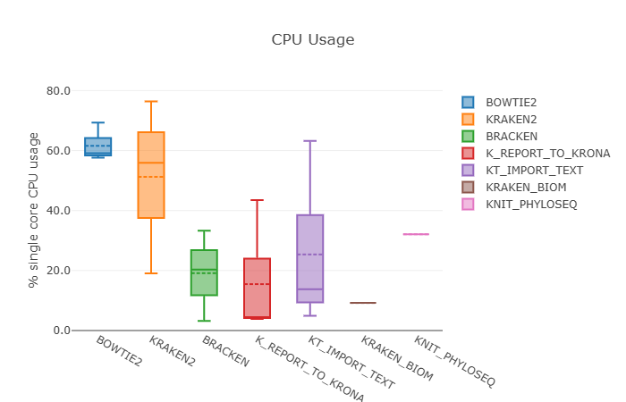

## TaxoFlow metagenomics pipeline

## Learning outcomes

**After having completed this chapter you will be able to:**

- Understand how **conditional execution with `if` statements** lets TaxoFlow switch between different input strategies.
- Recognise how **custom scripts and tools** (RMarkdown reports) are integrated into a Nextflow workflow.
- Enable and interpret a **native Nextflow execution report** to inspect resource usage and performance of the TaxoFlow pipeline.

## Material

[:fontawesome-solid-file-pdf: Download the presentation](../assets/pdf/part4.pdf){: .md-button }

## Overview of the TaxoFlow project

Let's go to the directory first:

```bash
cd /workspaces/nextflow-training/exercises/TaxoFlow
code .
```

??? abstract "These are the files in the directory"
    ```console title="TaxoFlow/"
      TaxoFlow
      ├── bin
      │   └── report.Rmd
      ├── data
      │   └── samplesheet.csv
      ├── modules
      │   ├── bowtie2.nf
      │   ├── bracken.nf
      │   ├── kReport2Krona.nf
      │   ├── kraken2.nf
      │   ├── kraken_biom.nf
      │   ├── knit_phyloseq.nf
      │   └── ktImportText.nf
      ├── main.nf
      ├── nextflow.config
      └── workflow.nf
    ```

The TaxoFlow pipeline allows to understand:

- How **conditional execution** is used to adapt to different input formats.
- How **custom scripts** and analysis reports are integrated as processes.
- How to use Nextflow’s **native report** to inspect resource usage.

Since on GitHub we cannot store heavy files, we need to download a database for Kraken2/Bracken and an indexed genome for Bowtie2, just run on the terminal:

```bash
mkdir -p data/krakendb && cd "$_"
wget --no-check-certificate --no-proxy 'https://zenodo.org/api/records/17708950/files/krakendb.tar.gz/content'
tar -xvzf content
rm -r content
cd -
mkdir -p data/genome && cd "$_"
wget --no-check-certificate --no-proxy 'https://genome-idx.s3.amazonaws.com/bt/TAIR10.zip'
unzip TAIR10.zip
rm -r TAIR10.zip
cd -
```

We can continue now.

The main entry point is:

- `main.nf`: user‑facing workflow definition.
- `workflow.nf`: DSL2 `workflow TaxoFlow` implementation.
- `modules/*.nf`: process modules wrapping the individual tools.
- `nextflow.config`: parameters, paths and native report configuration.

### The workflow at a glance

<figure markdown align="center">
  
</figure>

The TaxoFlow example is a small metagenomics workflow that:

- Uses **Bowtie2** to remove host (_Arabidopsis_; only for educational purposes) reads.
- Classifies remaining reads with **Kraken2** and **Bracken**.
- Generates interactive **Krona** plots and a **Phyloseq** HTML report.
- Demonstrates conditional logic, custom scripts and built‑in Nextflow reporting.

??? full-code "main.nf"
    ```groovy title="main.nf" linenums="1"
        #!/usr/bin/env nextflow

        include {TaxoFlow} from './workflow.nf'

        workflow {

            main:

            if(params.reads){
                    reads_ch = channel.fromFilePairs(params.reads, checkIfExists:true)
                } else {
                    reads_ch = channel.fromPath(params.sheet_csv)
                                    .splitCsv(header:true)
                                    .map {row -> tuple(row.sample_id, [file(row.fastq_1), file(row.fastq_2)])}
                }

            TaxoFlow(params.bowtie2_index, params.kraken2_db, reads_ch)

            // publish files
            publish:

            bowtie_unali = TaxoFlow.out.bowtie_unali
            kraken_class = TaxoFlow.out.kraken_class
            bracken_class = TaxoFlow.out.bracken_class
            k_report = TaxoFlow.out.k_report
            biom = TaxoFlow.out.biom

        }

        output {

            bowtie_unali {
                path 'bowtie2'
            }
            kraken_class {
                path 'kraken2'
            }
            bracken_class {
                path 'bracken'
            }
            k_report {
                path 'k_report'
            }
            biom {
                path 'biom'
            }
        }
    ```

??? full-code "workflow.nf"
    ```groovy title="workflow.nf" linenums="1"
        /*
        * required tasks
        */
        include { BOWTIE2                     }  from './modules/bowtie2.nf'
        include { KRAKEN2                     }  from './modules/kraken2.nf'
        include { BRACKEN                     }  from './modules/bracken.nf'
        include { K_REPORT_TO_KRONA           }  from './modules/kReport2Krona.nf'
        include { KT_IMPORT_TEXT              }  from './modules/ktImportText.nf'
        include { KRAKEN_BIOM                 }  from './modules/kraken_biom.nf'
        include { KNIT_PHYLOSEQ               }  from './modules/knit_phyloseq.nf'

        /*
        * workflow
        */

        workflow TaxoFlow {
            // required inputs
            take:
                bowtie2_index
                kraken2_db
                reads_ch
            // workflow implementation
            main:
                BOWTIE2(reads_ch, bowtie2_index)
                KRAKEN2(BOWTIE2.out, kraken2_db)
                BRACKEN(KRAKEN2.out, kraken2_db)
                K_REPORT_TO_KRONA(BRACKEN.out)
                KT_IMPORT_TEXT(K_REPORT_TO_KRONA.out)
                if(params.sheet_csv){
                    KRAKEN_BIOM(BRACKEN.out.collect())
                    KNIT_PHYLOSEQ(KRAKEN_BIOM.out)
                }

            emit:
                bowtie_unali = BOWTIE2.out
                kraken_class = KRAKEN2.out
                bracken_class = BRACKEN.out
                k_report = K_REPORT_TO_KRONA.out
                biom = KRAKEN_BIOM.out
        }
    ```

??? full-code "nextflow.config"
    ```groovy title="workflow.nf" linenums="1"
        /*
        * pipeline input parameters
        */

        params {
            reads                                 = null
            outdir                                = "${projectDir}/results"
            bowtie2_index                         = "${projectDir}/data/genome/TAIR10/TAIR10"
            kraken2_db                            = "${projectDir}/data/krakendb"
            sheet_csv                             = null
            report                                = "${projectDir}/bin/report.Rmd"
        }

        report {
            enabled = true
            file = "${projectDir}/results/performance_report.html"
        }

        // Enable using docker as the container engine to run the pipeline
        docker.enabled = true
    ```

## Conditional execution with `if` statements

TaxoFlow showcases **two layers** of conditional logic:

- At the **top‑level workflow** (`main.nf`) to decide how to build the read channel.
- Inside the **`TaxoFlow` workflow** (`workflow.nf`) to decide whether to run downstream reporting steps.

### Choosing the input strategy in `main.nf`

In `main.nf`:

```groovy title="main.nf" linenums="9"
    if(params.reads){
            reads_ch = channel.fromFilePairs(params.reads, checkIfExists:true)
        } else {
            reads_ch = channel.fromPath(params.sheet_csv)
                            .splitCsv(header:true)
                            .map {row -> tuple(row.sample_id, [file(row.fastq_1), file(row.fastq_2)])}
        }
```

Here, the `if` statement decides **how inputs are parsed**:

- **Branch 1 – `params.reads` is set**:
    - Use `channel.fromFilePairs(params.reads, checkIfExists:true)` to build a channel of paired‑end read files directly from a glob pattern.
    - This is convenient when your reads are already organised on disk and you do not need a sample sheet.
- **Branch 2 – `params.reads` is not set**:
    - Use `channel.fromPath(params.sheet_csv)` followed by `.splitCsv(header:true)` to read a CSV samplesheet.
    - Map each row into a tuple: `tuple(row.sample_id, [file(row.fastq_1), file(row.fastq_2)])`.
    - This is useful when metadata such as `sample_id` is stored in a table.

In both cases the result is a **single channel `reads_ch`** that emits:

- A `sample_id` value.
- A list with the two FASTQ files.

The rest of the pipeline (`TaxoFlow(...)`) is **independent of how `reads_ch` was created**, illustrating a common pattern:

- Use `if` blocks early in the workflow to normalize different input formats into a **canonical channel shape**.

??? tip "If structure"
    Abstracting the `if` block from `main.nf`:
        ```groovy title="if statement" linenums="1"
        if(condition){
            do something
        } else {
            do something different
        }
        ```
    The `else` statement is not always required.

### Conditional reporting inside `workflow.nf`

In `workflow.nf`:

```groovy title="workflow.nf" linenums="29"
        if(params.sheet_csv){
            KRAKEN_BIOM(BRACKEN.out.collect())
            KNIT_PHYLOSEQ(KRAKEN_BIOM.out)
        }
```

The inner `if (params.sheet_csv)` controls whether to:

- **Merge Bracken outputs across samples** with `KRAKEN_BIOM(BRACKEN.out.collect())`.
- **Render a Phyloseq HTML report** with `KNIT_PHYLOSEQ(KRAKEN_BIOM.out)`.

Key ideas:

- When running from a **samplesheet**, we know which samples belong together, so it makes sense to aggregate them into a single biom file and downstream report.
- When running from **raw file pairs only** (`params.reads`), `params.sheet_csv` is `null` in `nextflow.config`, so the extra report is skipped.

This is a clean way to:

- Keep **core processing** always enabled.
- Toggle **extra reporting or QC steps** based on parameters.

**Exercise:** Now, you want to control the entire execution of the workflow given a parameter provided in `nextflow.config` or through the terminal. How would you implement it?

??? tip "Organize your ideas"
    1. Create the parameter and initialize it in `nextflow.config`.
    2. Identify in which file you are going to use it.
    3. Determine the scope of the parameter, meaning which or which processes it is going to control.
    4. Implement it and execute the pipeline with:
    ```bash
    nextflow run main.nf --sheet_csv 'data/samplesheet.csv' --yourParameter
    ```
??? success "Answer"
    Find below how the files would be modified.

??? full-code "nextflow.config"
    ```groovy title="nextflow.config" linenums="1" hl_lines="12"
        /*
        * pipeline input parameters
        */

        params {
            reads                                 = null
            outdir                                = "${projectDir}/results"
            bowtie2_index                         = "${projectDir}/data/genome/TAIR10/TAIR10"
            kraken2_db                            = "${projectDir}/data/krakendb"
            sheet_csv                             = null
            report                                = "${projectDir}/bin/report.Rmd"
            control                               = false
        }

        report {
            enabled = true
            file = "${projectDir}/results/performance_report.html"
        }

        // Enable using docker as the container engine to run the pipeline
        docker.enabled = true
    ```

??? full-code "main.nf"
    ```groovy title="main.nf" linenums="1" hl_lines="17-19"
        #!/usr/bin/env nextflow

        include {TaxoFlow} from './workflow.nf'

        workflow {

            main:

            if(params.reads){
                    reads_ch = channel.fromFilePairs(params.reads, checkIfExists:true)
                } else {
                    reads_ch = channel.fromPath(params.sheet_csv)
                                    .splitCsv(header:true)
                                    .map {row -> tuple(row.sample_id, [file(row.fastq_1), file(row.fastq_2)])}
                }

            if (params.control){
                    TaxoFlow(params.bowtie2_index, params.kraken2_db, reads_ch)
            }

            // publish files
            publish:

            bowtie_unali = TaxoFlow.out.bowtie_unali
            kraken_class = TaxoFlow.out.kraken_class
            bracken_class = TaxoFlow.out.bracken_class
            k_report = TaxoFlow.out.k_report
            biom = TaxoFlow.out.biom
        }

        output {

            bowtie_unali {
                path 'bowtie2'
            }
            kraken_class {
                path 'kraken2'
            }
            bracken_class {
                path 'bracken'
            }
            k_report {
                path 'k_report'
            }
            biom {
                path 'biom'
            }
        }
    ```

## Custom scripts and analysis modules

TaxoFlow uses several modules that wrap external command‑line tools (Bowtie2, Kraken2, Bracken, Krona), plus a custom **RMarkdown report** to explore taxonomic profiles.

### Custom RMarkdown report with `KNIT_PHYLOSEQ`

The Phyloseq report is driven by the module `KNIT_PHYLOSEQ` and the RMarkdown file under `bin/`:

```groovy title="modules/knit_phyloseq.nf" linenums="1"
process KNIT_PHYLOSEQ {
    tag "knit_phyloseq"
    container "community.wave.seqera.io/library/bioconductor-phyloseq_knit_r-base_r-ggplot2_r-rmdformats:6efceb52eb05eb44"

    input:
    path merged

    output:
    stdout

    script:
    def report = params.report
    def outdir = params.outdir
    """
    biom_path=\$(realpath ${merged})
    outreport=\$(realpath ${outdir})
    Rscript -e "rmarkdown::render('${report}', params=list(args='\${biom_path}'),output_file='\${outreport}/report.html')"
    """
}
```

??? tip "Where do we store custom scripts?"
        Whenever you decide to use custom scripts, Nextflow will search for them in the directory `bin/`. Thus, you just need to place them in this folder.

The execution of the RMarkdown script is a bit tricky since it requires a path that usually is given just a string, although here, we had to use Bash variables to create this path. This is a specific case, you don't need to pay too much attention to this, just keep in mind that running custom scripts is usually problematic.

This script then generates an **HTML report** with:

- Absolute and relative abundance bar plots.
- α‑ and β‑diversity metrics.
- Heatmaps, ordination and network plots.

<figure markdown align="center">
  
  <figcaption>Plot example within the custom report.</figcaption>
</figure>

As a result, this shows a pattern:

- Keep **analysis logic** in a domain‑specific script (here RMarkdown).
- Drive it from Nextflow via parameters and inputs.
- Treat the final HTML as just another pipeline output, versioned and reproducible.

**Exercise:** Within the `modules/knit_phyloseq.nf` you can notice that some variables like `biom_pat` and `outreport` are preceded by a backslash (\\). Remove these backslashes, execute the pipeline and see what happens. Then answers: why do you think this was necessary?

??? success "Not the same"
    In Nextflow, it is really important to distinguish Nextflow variables from Bash or environment variables. This is achieved through the use of double quotes in the script section plus adding the _escape_ character (backslash) **before Bash variables**. [More about this](https://docs.seqera.io/nextflow/process#script:~:text=the%20pipeline%20script.-,WARNING,-Since%20Nextflow%20uses)

## Native Nextflow report for resource usage

TaxoFlow also enables Nextflow’s **native HTML execution report**, which summarises:

- Wall‑clock time and CPU usage per process.
- Memory usage and I/O statistics.
- Number of tasks, retries and failures.

### Enabling the built‑in report

In `nextflow.config`:

```groovy title="nextflow.config" linenums="14"
report {
    enabled = true
    file = "${projectDir}/results/performance_report.html"
}
```

This block tells Nextflow to:

- Generate a **single HTML report** named `report.html` at the end of each run.
- Place it in the **results directory** from where you launched Nextflow.

You do not need to change `main.nf` or `workflow.nf` to use this feature; it is entirely controlled by configuration.

### Running TaxoFlow and inspecting the report

The workflow can be executed without adding anything else:

```bash
nextflow run main.nf \
    --sheet_csv data/samplesheet.csv
```

??? info "Enabling the report as a parameter"
    It is possible to generate the report just by adding `-with-report <file_name>`. [More about this](https://docs.seqera.io/nextflow/reports#execution-report)

At the end of the execution you should see a message similar to:

```text
Execution report saved to: report.html
```

Open `report.html` in a browser. You will find:

- A **timeline** of all tasks across processes like `BOWTIE2`, `KRAKEN2`, `BRACKEN`, etc.
- A **resources** table with CPU, memory and time usage per process.
- A **tasks** section showing how many samples were processed and how long each step took.

<figure markdown align="center">
  
  <figcaption>Plot example within the performance report.</figcaption>
</figure>

This native report complements the domain‑specific Phyloseq HTML:

- The **Nextflow report** focuses on **pipeline performance and resource usage**.
- The **Phyloseq report** focuses on **biological interpretation** of the metagenomic profiles.

??? tip "Customizing the report location"
    - To save the report under the project directory, you can update `file`:
      ```groovy
      report {
          enabled = true
          file = "${projectDir}/results/performance_report.html"
      }
      ```
    - This keeps all outputs (taxonomy results, Krona plots, RMarkdown report, Nextflow report) under a single `results/` tree.

## Summary

- TaxoFlow uses **conditional execution** both at the entry point and inside the workflow to adapt to different input sources and to toggle optional reporting steps.
- Custom analysis code (RMarkdown, Krona, Phyloseq) is wrapped as **Nextflow modules**, turning ad‑hoc scripts into reproducible pipeline stages.
- Nextflow’s **native execution report** provides a built‑in way to understand resource usage and performance, complementing the biological reports produced by the pipeline.