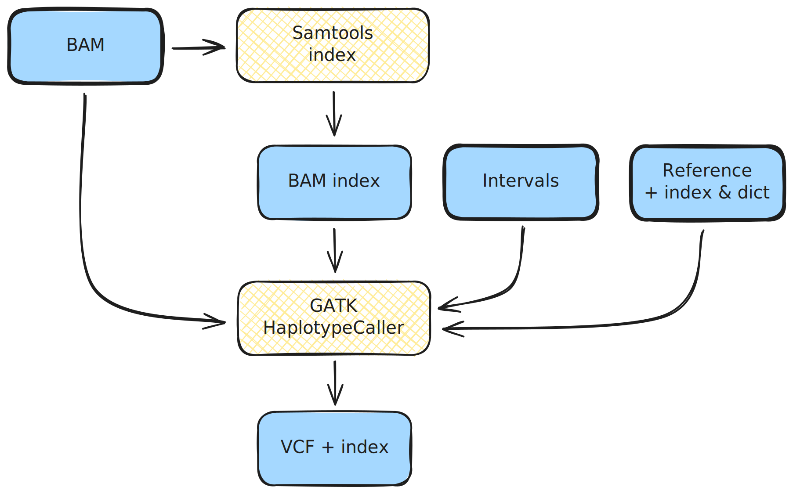

## Genomics variant-calling pipeline (exercise)

## Learning outcomes

**After having completed this chapter you will be able to:**

- Implement a small genomics pipeline that indexes BAM files and calls variants.
- Organize the workflow into an entry script, process modules and a configuration file.
- Use a sample sheet and reference files to drive the pipeline.
- Produce per-sample VCF files and indexes starting from pre-aligned BAM files.

## Scenario

### The pipeline

<p style='text-align: justify;'>Variant calling is a genomic analysis method that aims to identify variations in a genome sequence relative to a reference genome. Here we are going to use tools and methods designed for calling short germline variants, i.e. SNPs and indels, in whole-genome sequencing data. A full variant calling pipeline typically involves a lot of steps, including mapping to the reference (sometimes referred to as genome alignment) and variant filtering and prioritization. For simplicity, in this course we are going to focus on just the variant calling part.</p>

<figure markdown align="center">
  
</figure>

You are given **pre-aligned BAM files** for a trio (mother, father, child) and a **reference genome**. Your task is to:

- **Index** each BAM file.
- **Call variants** on each indexed BAM using GATK HaplotypeCaller.
- Organize the outputs by type (BAMs and VCFs) in dedicated result folders.

You will write:

- A workflow file (entry point).
- Two modules (one for BAM indexing, one for variant calling).
- A configuration file with default parameters and a convenient profile.

The reference implementation can be found under `solutions/genomics-pipeline/`. Your goal is to recreate this behaviour as an exercise in the corresponding `exercises/` folder.

## Data and directory layout

### Starting directory

Work in the **exercise folder**:

```bash
cd exercises/genomics-pipeline
```

This is the project folder structure aiming at developing a modularized, reproducible and scalable pipeline:

??? abstract "These are the files in the directory"
    ```console title="genomics-pipeline/"
        genomics-pipeline
        ├── data
        │   ├── bam
        │   │   ├── reads_father.bam
        │   │   ├── reads_mother.bam
        │   │   └── reads_son.bam
        │   ├── ref
        │   │   ├── intervals.bed
        │   │   ├── ref.dict
        │   │   ├── ref.fasta
        │   │   └── ref.fasta.fai
        │   └── samplesheet.csv
        ├── genomics.nf
        ├── modules
        │   ├── gatk_haplotypecaller.nf
        │   └── samtools_index.nf
        └── nextflow.config
    ```

!!! info "Nextflow files"
    - Remember that the nextflow files are scaffolded only, meaning that they have the structure but not the content (except for the Docker containers where the processes will be executed).

### Samplesheet

The file `data/samplesheet.csv` contains one BAM per line:

```csv title="data/samplesheet.csv"
sample_id,reads_bam
NA12878,data/bam/reads_mother.bam
NA12877,data/bam/reads_father.bam
NA12882,data/bam/reads_son.bam
```

- `sample_id`: sample identifier.
- `reads_bam`: path to the input BAM (relative to the project root).

### Reference files

In `data/ref/` you have:

- `ref.fasta`: reference genome FASTA.
- `ref.fasta.fai`: FASTA index.
- `ref.dict`: sequence dictionary.
- `intervals.bed`: list of genomic intervals (subset of the genome to analyse).

## Exercise 1 – Configuration file

Use the `nextflow.config` file in `exercises/genomics-pipeline/` to create the following requirements:

- **Container engine**
    - Enable Docker globally.
- **Set the parameters**
    - `input`
    - `reference`
    - `reference_index`
    - `reference_dict`
    - `intervals`

- **Crate the profile `test`** that sets:
    - `input` to `samplesheet.csv`.
    - `reference` to `ref.fasta`.
    - `reference_index` to `ref.fasta.fai`.
    - `reference_dict` to `ref.dict`.
    - `intervals` to `intervals.bed`.

??? tip "Paths"
    - Remember that you need to consider the file locations. Refer to files with so that the paths work regardless of where the workflow is launched. You can use `${projectDir}` to set the current directory as _root_ to launch the pipeline.

!!! tip "You should be able to run the pipeline with:"
      ```bash
      nextflow run genomics.nf -profile test
      ```

## Exercise 2 – BAM indexing module

Implement a module `modules/samtools_index.nf` that:

- Receives a BAM file as input.
- Runs `samtools index` to create the index (`.bai`).

??? tip "Example samtools command"
      ```bash
      samtools index 'example.bam'
      ```
      It creates the file `example.bam.bai`

- Emits both the original BAM and the index as outputs in a tuple.

??? tip "Tuple structure"
    ```groovy title="modules/samtools_index.nf" linenums="14"
        tuple path(`example.bam`), path(`example.bam.bai`)
    ```

??? success "Checklist"
    - Does the process emit **both** the BAM and its index?
    - Does the filename of the `.bai` _match_ the BAM (e.g. `reads_mother.bam.bai`)?

## Exercise 3 – Variant-calling module

Implement a module `modules/gatk_haplotypecaller.nf` that:

- Receives:
    - A tuple with a BAM and its index.
    - The reference FASTA, its index and dictionary.
    - The intervals file.

??? tip "Input structure"
    ```groovy title="modules/gatk_haplotypecaller.nf" linenums="11"
          tuple path(example.bam), path(example.bam.bai)
          example_ref.fasta
          example_ref.index
          example_ref.dict
          example_interval_list.bed
    ```

- Runs GATK HaplotypeCaller to call variants.

??? tip "Example GATK command"
      ```bash
          gatk HaplotypeCaller -R example_ref.fasta -I example.bam -O example.bam.vcf -L example_interval_list.bed
      ```
      It creates the file `example.bam.vcf` and `example.bam.vcf.idx`. You can split long commands using backslash (\\).

??? info "Don't you notice something?"
    We don't need to specify the path to the index file; the tool will automatically look for it in the same directory, based on the established naming and co-location convention. The same applies to the reference genome's accessory files (index and sequence dictionary files, *.fai and *.dict).    

- Emits a VCF file (`example.bam.vcf`) and its index (`example.bam.vcf.idx`).

??? tip "Output structure"
    ```groovy title="modules/gatk_haplotypecaller.nf" linenums="18"
          example.bam.vcf        , emit: vcf
          example.bam.vcf.idx    , emit: idx
    ```

??? success "Checklist"
    - Does each input BAM produce exactly one VCF and one VCF index?
    - Are VCF filenames clearly linked to the BAM filenames?

## Exercise 4 – Workflow file

Populate the file `genomics.nf` as the entry point of the pipeline with the following behaviour.

### Module inclusion

At the top of `genomics.nf`, include the two modules:

??? tip "Importing modules"
    - Remember where the modules are stored, relative to workflow file, what their names are, and what they contain.
    ```groovy title="genomics.nf" linenums="1"
          whatYouWantToInclude { nameOfTheProcess           }        from 'whereAreTheModules'
    ```

### Workflow logic

In the `workflow` block:

1. **Create the BAM channel**
    - Read `params.input` (CSV with header).
    - For each row, extract the `reads_bam` field and convert it to a file object.

??? tip "Read CSV"
    - You need to create a channel using one of the channel factories, then apply the operator _splitCsv()_, and then use _map{}_ to extract what you need from the CSV
    ```groovy title="genomics.nf" linenums="11"
        example_channel = channelFactory(whereTheCsvIs)
            .splitCsv(DoesItHaveHeader)
            .map { closure }
    ```

2. **Load reference paths**
    - Convert the parameters for reference, index, dictionary and intervals into file objects.

??? tip "Load parameters into file objects"
    - Use the function _file()_ to declare which parameters are required as files 
    ```groovy title="genomics.nf" linenums="16"
        anyFile = file(fileDeclaredInParameters)
    ```

3. **Index BAM files**
    - Run `SAMTOOLS_INDEX` on the BAM channel.

??? tip "Declare the process"
    - Remember that you have to use the name of the process and what the input(s) is/are. **They must match with the input declaration in the module itself**
    ```groovy title="genomics.nf" linenums="22"
        PROCESS(input)
    ```

4. **Call variants**
    - Run `GATK_HAPLOTYPECALLER` using:
        - The output of `SAMTOOLS_INDEX`.
        - The reference files.

??? tip "Declare the process"
    - **This process has many inputs, the order must match with the order declared in the module.**
    ```groovy title="genomics.nf" linenums="22"
        GATK_HAPLOTYPECALLER(
          OutputFromAnotherProcess,
          file1,
          file2,
          file3,
          file4
    )
    ```

### Published outputs

Add a `publish` section in the `workflow` that:

- Assigns:
      - `indexed_bam` to the output of `SAMTOOLS_INDEX`.
      - `vcf` and `vcf_idx` to the outputs of `GATK_HAPLOTYPECALLER`.

??? tip "Publish declaration"
    ```groovy title="genomics.nf" linenums="33"
        indexed_bam = OutputFromSamtoolsProcess
        vcf = VcfFileFromGATKProcess
        vcf_idx = indexFileFromGATKProcess
    ```

Then add an `output` block that:

- Writes:
      - All indexed BAMs and `.bai` files under `results/bam/`.
      - All VCFs and VCF indexes under `results/vcf/`.

??? tip "Output block"
    ```groovy title="genomics.nf" linenums="40"
    indexed_bam {
        whereToStoreBams
    }
    vcf {
        whereToStoreVCFs
    }
    vcf_idx {
        whereToStoreVCFIndeces
    }
    ```

**Question:** Why are there only three declared outputs?

??? success "Output of SAMTOOLS_INDEX"
    Remember that the output of SAMTOOLS_INDEX is a tuple, and hence that channel carries both files `.bam` and `.bam.bai`.

## Test the pipeline

!!! success "Run and verify"
    - Run:
      ```bash
      nextflow run genomics.nf -profile test
      ```
    - Check:
        - `results/bam/` contains three `.bam` files and three `.bai` files.
        - `results/vcf/` contains three `.vcf` files and three `.vcf.idx` files.

## Solution

??? success "Solution"
        You can find the solution to this exercise [here](https://github.com/jeffe107/nextflow-training/tree/main/solutions)